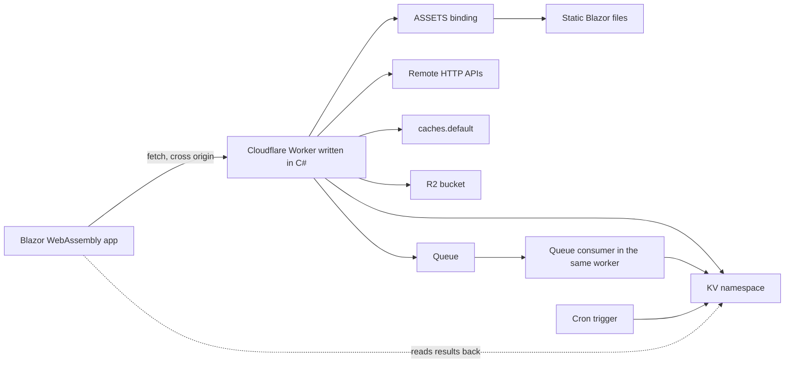

# Cloudflare Workers .NET

Write your Cloudflare Worker in **C#**, ship it as JavaScript.

This project compiles C# directly to a Cloudflare Worker module — no interpreter and no .NET
runtime on the edge. The worker is authored in plain C# (`net10.0`), compiled to
`src/WorkersDotNet/dist/worker.js` at build time, and served by Wrangler. A **Blazor WebAssembly**
frontend calls the worker's API and doubles as a live demo of every endpoint.



## Highlights

- **C# on the edge** — worker logic is ordinary C#: `async` methods, records, pattern matching,
  `System.Text.RegularExpressions`, all compiled ahead of time to a single JS module.
- **ASP.NET-style routing** — a central `switch` router maps URLs to endpoint classes, so a new
  route is one small class plus one `case`.
- **First-class response helpers** — `Results.Ok(...)` / `Results.Error(...)` make returning JSON a
  one-liner, the main use case for an API worker.
- **A dedicated CORS helper** — preflight and response headers handled in one place.
- **Shared models** — the same `ApiResponse` record is used by the worker and the Blazor client.
- **Every binding, worked through** — Cache API, KV, R2, queue producer *and* consumer, and an
  hourly scheduled task, all runnable locally with no Cloudflare account.
- **One-command local dev** — .NET Aspire starts the frontend and the worker together.
- **Wrangler for deploy** — the standard Cloudflare workflow, unchanged.

## Project layout

```
src/
  WorkersDotNet/            The Cloudflare Worker, written in C#
    Worker.cs               Entry point: the [Fetch] handler
    WorkerEvents.cs         The [Queue] consumer and the [Scheduled] cron handler
    Router.cs               URL -> endpoint mapping (add new URLs here)
    Results.cs              JSON response helpers
    Cors.cs                 CORS policy helpers
    Endpoints/              One class per route
      JsonEndpoint.cs       GET  /api/json
      ProxyEndpoint.cs      GET  /api/proxy
      RedirectEndpoint.cs   GET  /api/redirect
      PolicyEndpoint.cs     POST /api/policy
      CacheEndpoint.cs      GET/POST /api/cache        (Cache API sample)
      KvEndpoint.cs         GET/POST /api/kv           (KV sample)
      R2Endpoint.cs         /api/r2, /api/r2/download, /api/r2/delete
      QueueEndpoint.cs      GET/POST /api/queue        (queue producer + result)
      ScheduledEndpoint.cs  GET/POST /api/scheduled    (cron sample)
      AssetsEndpoint.cs     Fallback: serves the Blazor app via the ASSETS binding
  BlazorWebApp/             Blazor WebAssembly frontend that calls the worker
    Pages/                  One page per sample (see "Sample frontend")
    Services/WorkerApi.cs   Typed wrapper around HttpClient: timing, headers, JSON
    Shared/                 Layout, navigation and the small UI component library
  Shared/Models.cs          Records shared by the worker and the frontend
  Aspire/Aspire.AppHost/    Aspire host that orchestrates local development
wrangler.toml               Deploy config, with the [build] step and all bindings
wrangler.dev.toml           Local dev config, without the [build] step
cloudflarebuild.sh          CI/deploy build: publishes Blazor assets, then the worker
```

## API

| Method | Path                 | Description                                                                       |
| ------ | -------------------- | --------------------------------------------------------------------------------- |
| `GET`  | `/api/json`          | Returns a JSON `ApiResponse` — the JSON helper in action                           |
| `GET`  | `/api/proxy?url=`    | Fetches a remote URL server-side and tags the response with `x-proxied-by: Workers` |
| `GET`  | `/api/redirect?to=`  | Redirects to the given URL; cross-origin `fetch` callers receive the target in `location`       |
| `POST` | `/api/policy`        | Accepts a bounded JSON `ReadingInput` body and validates it                        |
| `GET`  | `/api/cache?key=`    | Cache API: serve from `caches.default`, or build and store (see below)             |
| `POST` | `/api/cache?key=`    | Cache API: purge the entry for that key                                            |
| `GET`  | `/api/kv`            | KV: reads the three fixed sample keys                                              |
| `POST` | `/api/kv`            | KV: writes up to 64 characters to one of the three fixed keys                      |
| `GET`  | `/api/r2`            | R2: metadata of `sample_file.txt` in `dotnettest`                                  |
| `POST` | `/api/r2`            | R2: uploads the raw request body (max 1 KB) as `sample_file.txt`, overwriting it   |
| `GET`  | `/api/r2/download`   | R2: streams the object back with its metadata headers                              |
| `POST` | `/api/r2/delete`     | R2: deletes the object                                                             |
| `GET`  | `/api/queue`         | Queue: reads the latest result and history the consumer wrote to KV                |
| `POST` | `/api/queue`         | Queue: puts a message of at most 16 characters on `dotnet-queue`                   |
| `GET`  | `/api/scheduled`     | Scheduled task: reads the latest run and history                                   |
| `POST` | `/api/scheduled`     | Scheduled task: runs the same code the cron trigger runs, on demand                |
| `*`    | anything else        | Falls through to the `ASSETS` binding, serving the Blazor app                      |

`OPTIONS` requests are answered by the CORS preflight helper for every path, but only advertised to
origins on the allow-list (see [CORS](#cors)). Every sample response carries
`cache-control: no-store` so the browser never hides a change behind its own HTTP cache.

## Bindings and samples

Five samples show what a worker can reach beyond plain HTTP. All of them work locally: `wrangler
dev` simulates the Cache API, KV, R2 and queues on this machine, so no Cloudflare account and no
sign-in are involved. Local state lives in `.wrangler/state/v3/` and survives restarts — delete that
folder to start from a clean slate.

| Sample | Binding in `wrangler.toml` | Resource name | What it does |
| ------ | -------------------------- | ------------- | ------------ |
| Cache API | `[cache] enabled = true` | — | `GET /api/cache?key=` looks the URL up in `caches.default`, answers a hit straight from the cache, and on a miss builds the JSON, stores a copy with `cache-control: max-age=300` and returns a fresh copy. `POST` purges the entry. |
| KV | `[[kv_namespaces]] binding = "KV"` | namespace `dotnet_test` | `POST /api/kv` writes at most 64 characters into one of the three fixed keys `sample_key_1`…`sample_key_3`; `GET /api/kv` reads all three back. |
| R2 | `[[r2_buckets]] binding = "R2"` | bucket `dotnettest` | Upload a file of at most 1 KB; it is always stored as `sample_file.txt`, so a new upload overwrites the previous one. `GET /api/r2/download` streams it back, `POST /api/r2/delete` removes it. |
| Queue (producer) | `[[queues.producers]] binding = "QUEUE"` | queue `dotnet-queue` | `POST /api/queue` puts a message of at most 16 characters on the queue together with the date it was queued. |
| Queue (consumer) | `[[queues.consumers]]` | queue `dotnet-queue` | `WorkerEvents.ConsumeAsync` receives the batch and writes the text plus *both* dates — queued and processed — to the KV key `queue_result` (and to `queue_history`). |
| Scheduled task | `[triggers] crons = ["0 * * * *"]` | — | `WorkerEvents.OnSchedule` runs every hour and writes the run to the KV key `scheduled_result` (and to `scheduled_history`). |

Two details are worth calling out, because they are easy to get wrong:

- **`[cache] enabled = true` is required locally.** Without it, `wrangler dev` answers
  `caches.default.match()` with "nothing cached" and silently drops `caches.default.put()`, so the
  cache sample could never show a hit. It is also why the stored copy carries `cache-control:
  max-age=300` — the Cache API ignores a response marked `no-store`.
- **The producer never talks to the consumer.** A worker has no memory between requests, so KV is
  the hand-off: the consumer writes `queue_result`, and `GET /api/queue` reads it back. The Blazor
  page polls that endpoint until the message it just sent shows up.

`env.Queue("QUEUE")` carries a JSON body (`QueueJob`), and the queue name (`dotnet-queue`) lives in
`SampleConfig` in `src/Shared/Models.cs` alongside the namespace name, bucket name, object key and
all the length limits, so the worker and the frontend cannot drift apart.

## Sample frontend

The Blazor app is not just a shell around the API; each sample gets a page that shows the request,
the response headers and the state it changed.

| Route | Page | What it demonstrates |
| ----- | ---- | -------------------- |
| `/` | Overview | Cards linking to every sample, plus the local-dev notes |
| `/basics` | Request basics | JSON, a server-side proxy `fetch`, a real 302, and a validated POST |
| `/cache` | Cache API | A key, a hit/miss badge driven by the `x-cache` response header, and a purge button |
| `/kv` | KV storage | The three fixed keys as tiles, a live character counter, write and read |
| `/r2` | R2 bucket | File picker with a 1 KB check, upload, download (browser *and* fetch-and-inspect) and delete |
| `/queue` | Queue | The producer form, and the consumer's result: text, queued at, processed at |
| `/scheduled` | Scheduled task | The latest KV record, the run history, and a button that runs the task now |

Every page shares the same building blocks from `src/BlazorWebApp/Shared/`
(`PageHeader`, `SampleCard`, `ApiCallLog`, `RawView`, `Notice`, `WorkerStatus`), so the
status code, reason phrase, duration and the interesting response header of each call are visible
without opening the browser's developer tools. `WorkerApi` in `src/BlazorWebApp/Services/` performs
every call, which is where the base URL, timing and JSON parsing live.

## Adding a URL

Adding an endpoint takes two small steps.

**1. Create the endpoint** in `src/WorkersDotNet/Endpoints/`:

```csharp
using Workers;

namespace WorkersDotNet
{
    public static class HelloEndpoint
    {
        public static Task<Response> HandleAsync(Request request)
        {
            return Task.FromResult(Results.Ok("Hello!", request.Path));
        }
    }
}
```

**2. Register it** in `Router.cs`:

```csharp
case "/api/hello":
    return await HelloEndpoint.HandleAsync(request);
```

That is all, the route is now live, CORS headers included for allowed origins.

## Response helpers

`Results` keeps endpoint bodies short and consistent:

```csharp
return Results.Ok("Reading accepted", request.Path);              // 200 + ApiResponse
return Results.Error("Method not allowed", 405);                  // error body with a requestId
return Results.Json(new ApiResponse(...), 201);                   // explicit status code
```

`Results.Error` returns `{ "error": "...", "requestId": "..." }`, which makes failures easy to
correlate with logs.

## CORS

Cross-origin access is an explicit allow-list; there is no wildcard. Allowed origins come from the
comma-separated `ALLOWED_ORIGINS` variable:

```toml
[vars]
ALLOWED_ORIGINS = "http://localhost:5217,https://localhost:7000,https://app.example.com"
```

The list is compiled into an anchored regular expression (`^(?:a|b)$`), so an origin has to match an
entry exactly and an empty or missing list grants no cross-origin access at all. `Cors.Apply` and
`Cors.Preflight` only emit `access-control-allow-origin` when `Cors.AllowedOrigin` accepts the
requesting origin, which means everything else is left to the browser to block.

Where the value is set:

| File             | Value                                     | Why                                                                                                                                          |
| ---------------- | ----------------------------------------- | -------------------------------------------------------------------------------------------------------------------------------------------- |
| `wrangler.dev.toml` | `http://localhost:5217,https://localhost:7000` | Under Aspire the Blazor frontend runs on its own port (`src/BlazorWebApp/Properties/launchSettings.json`) while the worker listens on `:8787`, so those calls are cross-origin |
| `wrangler.toml`  | empty                                     | The deployed Blazor app is served by this same worker through the `[assets]` binding (`ApiBaseUrl` is empty in `appsettings.json`), so its calls are same-origin and need no entry |

Add origins to `wrangler.toml` only when the frontend is hosted somewhere else, such as Cloudflare
Pages or a custom domain. Spaces around entries are ignored.

> Browsing the frontend as `127.0.0.1` instead of `localhost` produces a different origin. Add
> `http://127.0.0.1:5217` to the list if you prefer that host name.

## Prerequisites

- [.NET 10 SDK](https://dotnet.microsoft.com/download)
- [Node.js 20+](https://nodejs.org/) (for Wrangler)
- `npm install` at the repo root, to restore Wrangler

## Running locally

### With Aspire (recommended)

```bash
dotnet run --project src/Aspire/Aspire.AppHost
```

This starts the Blazor frontend and the worker, and opens the Aspire dashboard where you can follow
logs and endpoints for both.

### Without Aspire

Run the worker on its own — this publishes the C# worker and then starts Wrangler on port `8787`:

```bash
npm run worker:dev
```

`worker:dev` passes `--test-scheduled`, which enables `GET /__scheduled?cron=0+*+*+*+*` so you can
fire the cron handler by hand; the scheduled page links to it. Cron triggers also never fire on
their own in local dev, which is why the page has a "Run now" button.

Then run the frontend, which reads its API base URL from
`src/BlazorWebApp/wwwroot/appsettings.Development.json` (`http://localhost:8787`):

```bash
dotnet run --project src/BlazorWebApp
```

The bindings listed in [Bindings and samples](#bindings-and-samples) all work here: KV, R2 and the
queue are simulated on this machine, and the queue consumer runs in the same `wrangler dev`
process. Their state is kept in `.wrangler/state/v3/` — delete that folder for a clean slate.

## Building

Publish the worker on its own:

```bash
dotnet publish src/WorkersDotNet -c Release
```

This writes `src/WorkersDotNet/dist/worker.js`, which is the file `wrangler.toml` points at.

To produce the complete deployable output (Blazor static files **and** the worker):

```bash
sh cloudflarebuild.sh
```

The script publishes the Blazor app, copies its `wwwroot` into `src/WorkersDotNet/dist/wwwroot/`,
then publishes the worker. Wrangler serves that directory through the `ASSETS` binding.

## Deploying

Deployment uses the standard Cloudflare workflow. `wrangler.toml` declares a `[build]` step that
runs `cloudflarebuild.sh`, so Cloudflare builds the C# for you.

The bindings have to exist first, and the KV namespace needs its real id in `wrangler.toml`
(`id = "dotnet_test"` is the local placeholder):

```bash
npx wrangler queues create dotnet-queue
npx wrangler r2 bucket create dotnettest
npx wrangler kv namespace create dotnet_test     # paste the printed id into [[kv_namespaces]]
```

Then deploy:

```bash
npx wrangler deploy
```

## Conventions and compiler notes

The `Workers` compiler is a focused source-to-JavaScript emitter rather than a full .NET runtime.
It supports the common C# you would expect (`switch` statements, `const string` case labels, static
helper classes, anonymous objects, records, `foreach`, LINQ-free collection types, `Regex`,
`DateTimeOffset`, `Guid`), but a few constructs are intentionally out of scope.

Practical consequences for this codebase:

- **Concrete parameter types only.** The compiler resolves method symbols against a supported
  whitelist, so helpers such as `Results` use overloads instead of a generic `Json<T>()`, and
  interfaces, delegates and `object` parameters are avoided.
- **Static members.** Endpoints are static classes with a static `HandleAsync`, resolved at compile
  time. This is why routing uses a `switch` rather than a delegate registry.
- **A response body can only be read once.** `WithHeader` / `WithoutHeader` rebuild a `Response`
  from `response.body`, so chaining them onto one object throws `TypeError: This ReadableStream is
  disturbed`. The cache sample therefore builds a separate `Response` for the copy it stores and for
  the copy it returns.
- **`const` fields inline; non-constant statics do not.** `const string X = SampleConfig.Foo;`
  compiles to a literal, while a non-constant static field is a compile error (`WRK110`).
- **Keep the router thin.** All logic lives in the endpoint classes, so the router stays a readable
  index of the worker's URLs.
- **`dist/` is generated.** It is gitignored; never edit it by hand.

## Credits

This project builds on the excellent **Workers** package and sample collection by
**[Iñigo Ruiz-Salinas](https://github.com/iruizsalinas)** — **<https://github.com/iruizsalinas/workers>**.

That repository provides the C#-to-Cloudflare-Workers compiler and the samples that made this
approach possible. The NuGet package `Workers` (`0.3.0`) used under `src/WorkersDotNet` comes from
there, and its description sums it up well: _"Compile a focused C# profile directly to minimal
Cloudflare Workers JavaScript."_ If you want to understand how C# is compiled for the edge, or see
many more worked examples than the handful here, start there.

The endpoint and helper structure in `src/WorkersDotNet` is a refactor of those samples into a
small, ASP.NET-style layout. Many thanks to the author for making C# on Workers possible.

## License

[MIT](LICENSE) — Copyright (c) 2026 Michiel Post.